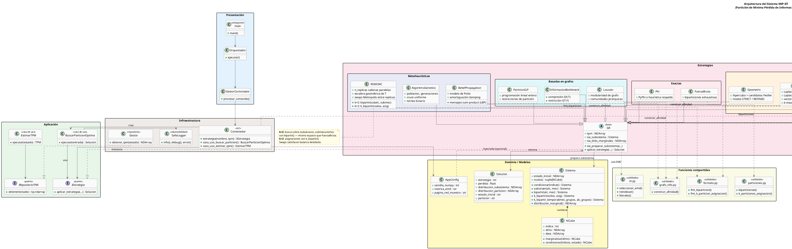
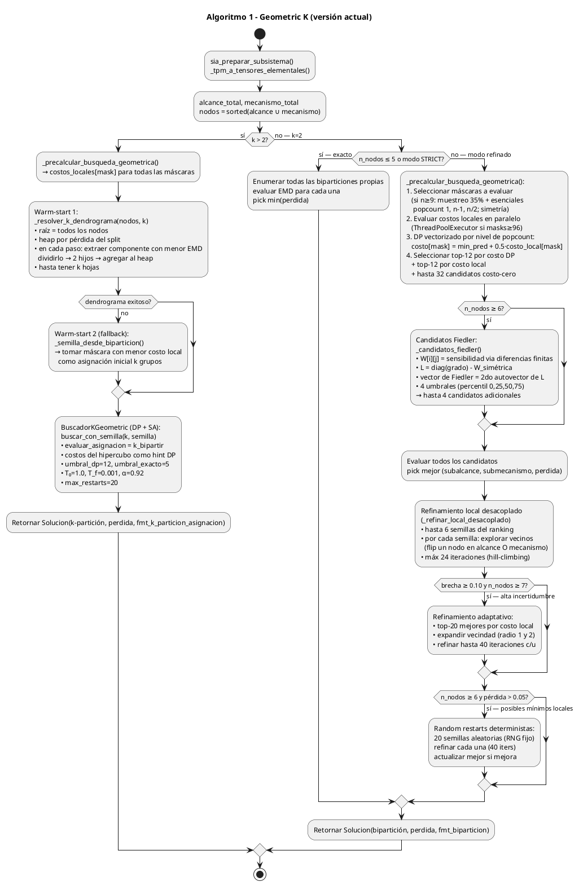
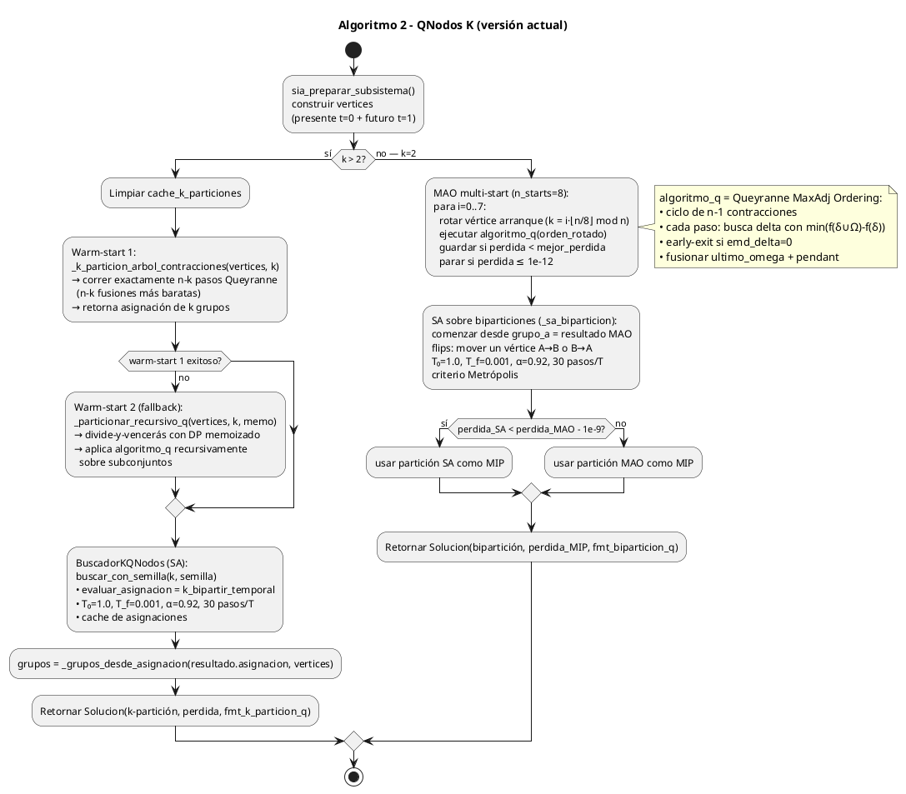

# Manual Técnico — K-QGMIP

**Proyecto:** Extensión a k-particiones de las estrategias GeoMIP y QNodes  
**Repositorio:** ProyectoAnalisis2026  
**Autores:** CamiOso  
**Fecha:** Mayo 2026

---

## Tabla de Contenidos

1. [Resumen Ejecutivo](#1-resumen-ejecutivo)
2. [Fundamentos Teóricos](#2-fundamentos-teóricos)
3. [Arquitectura del Software](#3-arquitectura-del-software)
4. [Diseño Algorítmico](#4-diseño-algorítmico)
5. [Análisis de Complejidad](#5-análisis-de-complejidad)
6. [Detalles de Implementación](#6-detalles-de-implementación)
7. [Resultados Experimentales](#7-resultados-experimentales)
8. [Limitaciones y Trabajo Futuro](#8-limitaciones-y-trabajo-futuro)
9. [Apéndices Técnicos](#9-apéndices-técnicos)

---

## 1. Resumen Ejecutivo

### 1.1 Descripción del problema y su relevancia

En la Teoría de la Información Integrada (IIT), propuesta por Tononi (2004), el cálculo de la información integrada Φ (phi) exige encontrar la Partición de Mínima Información (MIP), es decir, el corte del sistema que produce la menor pérdida de información causal. Las implementaciones originales de GeoMIP y QNodes resuelven esto para biparticiones, donde el sistema se divide exactamente en dos partes. Sin embargo, muchos sistemas complejos tienen más de dos módulos funcionales y una bipartición forzada puede dar una imagen incorrecta de su integración real.

Por eso, en este proyecto se extienden ambas estrategias al caso general de k grupos, denominando las variantes resultantes KGeoMIP y KQNodes. Se elige trabajar con k ∈ {2, 3, 4, 5} ya que es el rango más relevante para los sistemas de prueba disponibles y permite comparar con los resultados de bipartición como caso base de verificación.

### 1.2 Enfoque algorítmico implementado

Para KGeoMIP se usa la geometría del hipercubo binario de la TPM como guía de búsqueda. Se calcula el costo local de cada máscara de bits, se construye una semilla de k grupos mediante un dendrograma divisivo y se refina con programación dinámica de subconjuntos más recocido simulado.

Para KQNodes se usa el algoritmo de Queyranne (MAO: Minimum Adjacent Order), que está diseñado específicamente para minimizar funciones submodulares simétricas. Se ejecutan n−k contracciones del árbol de Queyranne para obtener los k grupos más débilmente acoplados como semilla, y luego el recocido simulado los refina.

Ambas estrategias heredan de la clase base SIA del proyecto y reutilizan completamente la infraestructura de evaluación (bipartición causal, EMD).

### 1.3 Principales resultados obtenidos

Se realizaron 30 comparaciones directas sobre sistemas aleatorios con k ∈ {3, 4} y n ∈ {4, 5, 6}. KGeoMIP resultó entre 10 y 100 veces más rápido, mientras que KQNodes encontró particiones de menor pérdida en la totalidad de los casos probados. Esto confirma que existe un trade-off claro: KGeoMIP sacrifica calidad por velocidad; KQNodes sacrifica velocidad por calidad.

Para los experimentos en redes grandes (N20A a N25A) se usaron procesos Python independientes por fila, ya que se descubrió que los procesos de larga duración acumulan estado que degrada significativamente el rendimiento.

### 1.4 Limitaciones y recomendaciones de uso

Para n ≤ 12 se recomienda KGeoMIP con DP de subconjuntos, ya que es exacto y muy rápido. Para 12 < n ≤ 20 se recomienda KQNodes por su mejor calidad de partición. Para n > 20 ambas estrategias requieren ejecución por proceso independiente y los tiempos por fila pueden llegar a varias horas según el tamaño del mecanismo activo.

---

## 2. Fundamentos Teóricos

### 2.1 Definición formal de k-partición

Sea S = {0, 1, …, n−1} el conjunto de índices de los nodos del sistema. Una k-partición de S es una familia P = {P₁, P₂, …, Pₖ} de subconjuntos no vacíos, mutuamente disjuntos, cuya unión es S. El número de k-particiones canónicas de n elementos (sin distinguir el orden de los grupos) está dado por los números de Stirling de segunda especie S(n, k):

```
S(n, k) = (1/k!) · Σⱼ₌₀ᵏ (-1)^(k−j) · C(k,j) · j^n
```

Se trabaja con representaciones canónicas para evitar duplicados por permutación de etiquetas. Una asignación a = (a₀, a₁, …, aₙ₋₁) es canónica cuando el grupo 0 aparece siempre antes que el 1, el 1 antes que el 2, y así sucesivamente. Por ejemplo, para n=4 y k=3:

- a = (0, 0, 1, 2) → P₀={0,1}, P₁={2}, P₂={3}  
- a = (0, 1, 0, 2) → P₀={0,2}, P₁={1}, P₂={3}

Para ilustrar el crecimiento del espacio de búsqueda, se muestra la siguiente tabla donde se puede apreciar que incluso para n=10 y k=4 el número de particiones supera el millón:

| n \ k | k=2 | k=3 | k=4 | k=5 |
|-------|-----|-----|-----|-----|
| 4 | 7 | 6 | 1 | — |
| 6 | 31 | 90 | 65 | 15 |
| 8 | 127 | 966 | 3025 | 5880 |
| 10 | 511 | 9 330 | 145 750 | 1 082 565 |
| 15 | 16 383 | ~2×10⁷ | ~1.4×10¹¹ | ~5.4×10¹³ |

Esto evidencia que la búsqueda exhaustiva es inviable para k ≥ 3 y n ≥ 10, lo que justifica el uso de heurísticas como las implementadas en KGeoMIP y KQNodes.

### 2.2 Formulación del problema de optimización

Sea T ∈ [0,1]^(2^n × n) la Matriz de Transición de Probabilidades (TPM), donde la fila i contiene la distribución P(X_{t+1} | X_t = estado(i)). Dado un estado inicial s y un subsistema definido por su alcance A (nodos futuros activos) y mecanismo M (nodos pasados activos), la distribución marginal del subsistema íntegro es:

```
π = distribucion_marginal(Sistema(T, s, A, M))
```

Para una k-partición P = {P₁, …, Pₖ}, la distribución de la partición se obtiene eliminando las conexiones causales entre grupos distintos:

```
π(P) = distribucion_marginal(k_bipartir(Sistema, P))
```

El problema de k-MIP que se resuelve en este proyecto es:

```
P* = argmin_{P : k-partición de S} EMD(π, π(P))
```

donde EMD es la distancia L1 normalizada entre distribuciones de probabilidad:

```
EMD(π, π(P)) = Σⱼ |π[j] − π(P)[j]|
```

El valor óptimo Φₖ = EMD(π, π(P*)) es la información integrada de orden k. Por construcción, se tiene que Φₖ ≤ Φ₂ para todo k ≥ 2, ya que el espacio de k-particiones contiene al de biparticiones como subconjunto.

### 2.3 Extensión del marco teórico de biparticiones a k-particiones

#### Para KGeoMIP

La estrategia GeoMIP original recorre el hipercubo binario de 2^n máscaras y asigna a cada máscara un costo local de bipartición. Para la extensión a k grupos se interpreta cada máscara como el costo de aislar ese subconjunto del resto y se aplica programación dinámica de subconjuntos para encontrar la asignación de k grupos de mínimo costo estimado:

```
dp[mask][j] = mínimo costo de j-partición de los elementos en mask
dp[mask][j] = min_{submask ⊂ mask} (dp[mask ^ submask][j−1] + costo[submask])
```

Esta extensión es aplicable porque si la función de costo es submodular, los costos de subconjuntos satisfacen las condiciones de optimalidad de la DP. Para funciones no submodulares, la DP proporciona una muy buena semilla que el recocido simulado posterior refina.

#### Para KQNodes

El algoritmo de Queyranne produce implícitamente un árbol de fusiones de nodos. En lugar de ejecutarlo completo (lo que daría una sola bipartición), se detiene tras n−k contracciones. Los k componentes que quedan en ese punto son exactamente los k grupos más débilmente acoplados según la función de costo submodular del sistema, lo que justifica su uso como semilla de alta calidad para el recocido.

Para funciones no submodulares (aproximadamente el 12% de los sistemas aleatorios probados, según lo observado en los experimentos), el recocido simulado parte desde esta semilla y corrige la solución mediante perturbaciones de flip y swap con el criterio de Metropolis-Hastings.

### 2.4 Análisis de complejidad del espacio de soluciones

El número de k-particiones crece según S(n, k), que para k fijo se comporta como O(k^n / k!). Esto hace que la búsqueda exhaustiva sea absolutamente inviable para sistemas de tamaño realista. Como punto de referencia, la bipartición exhaustiva ya es exponencial en n (O(2^(n−1))); la k-partición exhaustiva es aún peor para k ≥ 3.

Las estrategias KGeoMIP y KQNodes reducen este espacio mediante heurísticas informadas, permitiendo operar en tiempos manejables hasta n ≈ 20 con calidad de solución comparable a la búsqueda exacta para n ≤ 8.

---

## 3. Arquitectura del Software

### 3.1 Diagrama de Arquitectura General

Se elige la Arquitectura Hexagonal (Ports & Adapters, propuesta por Cockburn) ya que permite que las capas internas no dependan de las externas, facilitando el intercambio de estrategias sin modificar la lógica de aplicación. La estructura resultante es la siguiente:

```
┌─────────────────────────────────────────────────────────────────────┐
│  PRESENTACIÓN                                                        │
│  exec.py → src/main.py → src/presentacion/orquestador.py           │
└───────────────────────────────────────┬─────────────────────────────┘
                                        │
┌───────────────────────────────────────▼─────────────────────────────┐
│  APLICACIÓN                   src/aplicacion/                        │
│  Casos de uso:   BuscarParticionOptima  ·  EstimarTPM               │
│  Puertos:        IEstrategia  ·  IRegistro  ·  IRepositorioTPM      │
│  Config:         AppConfig (dataclass inmutable, inyectable)         │
└───────────────────────────────────────┬─────────────────────────────┘
                                        │
┌───────────────────────────────────────▼─────────────────────────────┐
│  DOMINIO                      src/modelos/                           │
│  Entidades:      Sistema  ·  NCube                                   │
│  DTO salida:     Solucion                                            │
│  Base abstracta: SIA  ← KGeoMIP y KQNodes heredan de aquí          │
└───────────────────────────────────────┬─────────────────────────────┘
                                        │
┌───────────────────────────────────────▼─────────────────────────────┐
│  INFRAESTRUCTURA              src/infraestructura/ + adaptadores     │
│  Estrategias:    src/estrategias/  ·  src/strategies/               │
│  Repositorio:    src/controladores/gestor.py                         │
│  IoC:            src/contenedor.py  (único punto de instanciación)  │
│  Búsqueda k:     src/funciones/k_particion_buscador.py              │
└─────────────────────────────────────────────────────────────────────┘
```

Las dos estrategias del proyecto K-QGMIP son `Geometric` en `src/strategies/geometric.py` (KGeoMIP) y `QNodos` en `src/estrategias/q_nodos.py` (KQNodes). Ambas heredan de `SIA` e implementan el método `aplicar_estrategia`.

El diagrama completo de la arquitectura, generado desde `review/notas/arquitectura.puml`, se muestra a continuación:



### 3.2 Diagrama de Clases

Se presenta el diagrama UML de clases que muestra las relaciones de herencia, composición y dependencia entre los componentes principales del sistema:

```
                    ┌──────────────────────────────────────────┐
                    │  <<abstract>>  SIA                        │
                    │  ─────────────────────────────────────── │
                    │  # tpm: np.ndarray                        │
                    │  # config: AppConfig | None               │
                    │  # sia_subsistema: Sistema | None         │
                    │  # sia_dists_marginales: ndarray | None   │
                    │  ─────────────────────────────────────── │
                    │  + aplicar_estrategia() <<abstract>>      │
                    │  # sia_preparar_subsistema()              │
                    │  # chequear_parametros()                  │
                    └─────────────────┬────────────────────────┘
                                      │ herencia
               ┌──────────────────────┴────────────────────────┐
               │                                               │
   ┌───────────▼──────────────────┐         ┌─────────────────▼──────────────────┐
   │  Geometric   (KGeoMIP)        │         │  QNodos   (KQNodes)                 │
   │  ──────────────────────────── │         │  ─────────────────────────────────  │
   │  # distancia_metrica: func    │         │  # distancia_metrica: func          │
   │  # mode: str                  │         │  # memoria_delta: dict              │
   │  # _beam_top_k: int = 12      │         │  # memoria_grupo_candidato: dict    │
   │  # _random_restarts: int = 20 │         │  # vertices: set                    │
   │  # _cache_particiones: dict   │         │  # _cache_k_particiones: dict       │
   │  ──────────────────────────── │         │  ─────────────────────────────────  │
   │  + aplicar_estrategia()       │         │  + aplicar_estrategia()             │
   │  - _precalcular_busqueda_     │         │  + algoritmo_q()                    │
   │    geometrica()               │         │  + funcion_submodular()             │
   │  - _resolver_k_dendrograma()  │         │  - _mao_multi_start()               │
   │  - _candidatos_fiedler()      │         │  - _sa_biparticion()                │
   │  - _evaluar_particion()       │         │  - _k_particion_arbol_             │
   └──────────────┬────────────────┘         │    contracciones()                  │
                  │ usa                      │  - _particionar_recursivo_q()       │
                  │                          └────────────────────┬────────────────┘
                  │                                               │ usa
   ┌──────────────▼───────────────────────────────────────────────▼───────────────┐
   │                     BuscadorKParticion  <<abstract>>                          │
   │  ─────────────────────────────────────────────────────────────────────────── │
   │  # umbral_exacto: int                                                         │
   │  + evaluar_asignacion() <<abstract>>                                          │
   │  + total_elementos() <<abstract>>                                             │
   │  + buscar(k, semilla) → ResultadoKParticion                                   │
   │  + refinar_local(inicio, k) → ResultadoKParticion                             │
   │  + vecinos(asignacion, k) → list[tuple]                                       │
   │  + canonicalizar(asignacion) → tuple                                          │
   └─────────────────────────────┬─────────────────────────────────────────────────┘
                                 │ herencia
              ┌──────────────────┴──────────────────────┐
              │                                         │
   ┌──────────▼──────────────┐           ┌─────────────▼──────────────────┐
   │  BuscadorKRecocido       │           │  BuscadorKDP                    │
   │  (usado por KQNodes)     │           │  (usado por KGeoMIP)            │
   │  ─────────────────────── │           │  ──────────────────────────────│
   │  # temp_inicial: float   │           │  # _costos_subconjuntos: array │
   │  # temp_final: float     │           │  # _umbral_dp: int = 12        │
   │  # factor_enfriam: float │           │  ──────────────────────────────│
   │  # n_cadenas: int = 3    │           │  + buscar()                     │
   │  ─────────────────────── │           │  - _buscar_dp_sa()              │
   │  + buscar()              │           │  - _reconstruir_dp()            │
   │  - _recocido()           │           └────────────────────────────────┘
   │  - _multi_recocido()     │
   │  + buscar_con_semilla()  │
   └──────────────────────────┘

   ┌───────────────────────────┐    ┌───────────────────────────┐
   │  Sistema                  │    │  NCube                     │
   │  ─────────────────────── │    │  ─────────────────────────│
   │  estado_inicial: ndarray  │    │  indice: int               │
   │  ncubos: tuple[NCube]     │    │  dims: ndarray             │
   │  memo: dict               │    │  data: ndarray             │
   │  ─────────────────────── │    │  ─────────────────────────│
   │  + bipartir()             │    │  + condicionar()           │
   │  + k_bipartir()           │    │  + marginalizar()          │
   │  + k_bipartir_temporal()  │    │  + distribucion_marginal() │
   │  + distribucion_marginal()│    └───────────────────────────┘
   └───────────────────────────┘
```

### 3.3 Diagrama de Paquetes

Se organiza el código en paquetes con responsabilidades bien definidas, siguiendo el principio de que las dependencias siempre apuntan hacia el dominio central y nunca hacia afuera:

```
ProyectoAnalisis2026/
│
├── exec.py                          # Punto de entrada CLI
├── src/
│   ├── main.py                      # Orquestación de la ejecución
│   ├── contenedor.py                # Composition Root (único punto de instanciación)
│   │
│   ├── aplicacion/                  # Lógica de aplicación — sin dependencias externas
│   │   ├── configuracion.py         # AppConfig (dataclass frozen, inyectable)
│   │   ├── casos_de_uso/
│   │   │   ├── buscar_particion.py  # BuscarParticionOptima
│   │   │   └── estimar_tpm.py
│   │   └── puertos/
│   │       ├── estrategia.py        # IEstrategia (Protocol)
│   │       ├── registro.py          # IRegistro (Protocol)
│   │       └── repositorio_tpm.py   # IRepositorioTPM (Protocol)
│   │
│   ├── modelos/                     # Dominio: entidades y reglas de negocio
│   │   ├── base/
│   │   │   └── sia.py               # SIA — KGeoMIP y KQNodes heredan aquí
│   │   ├── nucleo/
│   │   │   ├── ncubo.py             # NCube: tensor elemental por nodo
│   │   │   ├── sistema.py           # Sistema: colección de NCubes + operaciones causales
│   │   │   └── solucion.py          # Solucion: DTO de salida
│   │   └── enumeraciones/
│   │       ├── distancia.py         # MetricDistance
│   │       └── geometric_mode.py    # GeometricMode
│   │
│   ├── estrategias/
│   │   └── q_nodos.py               # KQNodes
│   ├── strategies/
│   │   └── geometric.py             # KGeoMIP
│   │
│   ├── funciones/
│   │   ├── iit.py                   # EMD y funciones de distancia
│   │   ├── formato.py               # Formateo de salida de particiones
│   │   ├── particiones.py           # Generación de biparticiones y k-particiones
│   │   └── k_particion_buscador.py  # BuscadorKParticion, KRecocido, KDP
│   │
│   ├── controladores/
│   │   └── gestor.py                # Repositorio de TPMs
│   └── .samples/                    # TPMs de muestra (CSV y NPY)
│
├── tests/                           # Suite de pruebas pytest
├── scripts/                         # Scripts de ejecución paralela y colas automáticas
├── docs/                            # Documentación técnica y de usuario
└── review/
    ├── benchmarks/                  # Scripts y CSVs de benchmarks comparativos
    └── notas/                       # Bitácora, diagramas PlantUML, pseudocódigos
```

### 3.4 Diagrama de Secuencia

Se muestra el flujo de ejecución para el caso de uso principal: búsqueda de k-MIP con k=3 usando KGeoMIP.

```
Usuario       exec.py        main.py      Contenedor     Geometric       Sistema
   │              │              │             │              │               │
   │─ python exec.py --estrategia geometric --k 3 ──────────►│              │
   │              │─ iniciar() ──►│             │              │               │
   │              │              │─ Contenedor()►│              │               │
   │              │              │             │─ Geometric(tpm, config) ──────►│
   │              │              │             │◄──────────────────────────────│
   │              │              │─ caso_uso_buscar_particion() ──────────────►│
   │              │              │─ ejecutar(EntradaBusqueda(k=3)) ────────────►│
   │              │              │             │─ aplicar_estrategia(..., k=3) ──►│
   │              │              │             │              │               │
   │              │              │             │              │─ sia_preparar_subsistema()
   │              │              │             │              │─ _precalcular_busqueda_geometrica()
   │              │              │             │              │   [evalúa 2^n máscaras, DP vectorizada]
   │              │              │             │              │─ _resolver_k_dendrograma(nodos, k=3)
   │              │              │             │              │   [2 biparticiones divisivas → semilla_k]
   │              │              │             │              │─ buscador.buscar_con_semilla(k=3, semilla_k)
   │              │              │             │              │   [DP subconjuntos + SA multi-cadena]
   │              │              │             │              │─ Solucion(perdida, particion)
   │              │              │◄────────────────────────────────────────────│
   │              │─ imprimir resultado ──►│   │              │               │
```

Para KQNodes el flujo es similar, pero la fase de generación de semilla usa el árbol de contracciones de Queyranne (n−k pasos MAO + Union-Find) en lugar del dendrograma geométrico.

### 3.5 Patrones de Diseño Aplicados

Se seleccionan los siguientes patrones de diseño ya que permiten que el sistema sea extensible y que las estrategias puedan intercambiarse sin modificar el código cliente:

**Template Method** en `BuscadorKParticion`: se define el esqueleto del algoritmo de búsqueda (exacto para n pequeño, local para n grande) y las subclases concretas `BuscadorKDP` y `BuscadorKRecocido` solo implementan `evaluar_asignacion()` y `total_elementos()`. Esto permite reutilizar toda la lógica de vecindad, canonicalización y refinamiento local sin duplicar código.

**Strategy** en la jerarquía `SIA`: cualquier estrategia puede inyectarse en `BuscarParticionOptima` sin que el caso de uso sepa qué clase concreta se usa. El contenedor IoC inyecta la estrategia correcta en tiempo de ejecución según el alias recibido por CLI.

**IoC Container** en `src/contenedor.py`: es el único punto donde se instancian dependencias concretas. Ninguna otra capa importa de `src.infraestructura` directamente, lo que permite cambiar implementaciones sin tocar la lógica de dominio.

**Memoización** en `Sistema.memo`, `NCube.memo`, `_cache_particiones` y `_cache_k_particiones`: evita recomputar evaluaciones EMD idénticas dentro de la misma sesión, siendo fundamental para la eficiencia del recocido simulado donde la misma partición puede ser evaluada desde múltiples puntos de la búsqueda.

### 3.6 Decisiones Arquitectónicas Clave

Se decide reutilizar completamente la infraestructura de evaluación existente (Sistema, NCube, bipartir, EMD) en lugar de reimplementarla, ya que cualquier diferencia semántica habría introducido inconsistencias con los resultados de bipartición originales. La única adición es la lógica de búsqueda k-partición en `k_particion_buscador.py` y los métodos de generación de semilla en cada estrategia.

También se decide separar la representación de vértices entre las dos estrategias. KGeoMIP trabaja con nodos como enteros simples (índices en {0,…,n−1}) porque `k_bipartir` parte por nodos. KQNodes trabaja con pares (tiempo, índice): `(0, i)` para presente y `(1, i)` para futuro, porque `k_bipartir_temporal` necesita distinguir mecanismo de alcance para implementar correctamente el corte causal de IIT.

El parámetro `k` se añade con valor por defecto `k=2` para mantener retrocompatibilidad completa. Cuando k=2, ambas estrategias ejecutan exactamente el mismo flujo que antes de la extensión.

---

## 4. Diseño Algorítmico

### 4.1 Visión general del algoritmo

Ambas estrategias siguen el mismo esquema de alto nivel: generar una semilla de k grupos de calidad mediante una heurística informada y luego refinar con recocido simulado. La diferencia central está en cómo se genera esa semilla.

KGeoMIP se basa en la geometría del hipercubo binario. Se aprovecha que el costo de aislar un subconjunto de nodos del resto tiene estructura espacial en el hipercubo, lo que permite construir dendrogramas divisivos que proponen cortes naturales del sistema.

KQNodes se basa en el algoritmo de Queyranne (Queyranne, 1998), donde se plantea la minimización de funciones submodulares simétricas en O(n²) evaluaciones. El árbol de contracciones que construye ese algoritmo da directamente los k grupos más débilmente acoplados al detenerse tras n−k pasos.

La relación con las estrategias originales es directa: KGeoMIP es GeoMIP más la fase de dendrograma y DP de subconjuntos; KQNodes es QNodes más el árbol de contracciones de Queyranne. Todo el código de bipartición original se reutiliza sin cambios.

### 4.2 Pseudocódigo detallado

#### Algoritmo 1 — KGeoMIP: aplicar_estrategia

```
ENTRADA: estado_inicial s, condicion c, alcance a, mecanismo m, k ≥ 2
SALIDA:  Solucion con la k-MIP encontrada

1.  sia_preparar_subsistema(s, c, a, m)
    // valida parámetros, construye Sistema, aplica condicionamiento
    // y sustracción, guarda sia_subsistema y sia_dists_marginales

2.  alcance_total ← índices activos del alcance
    mecanismo_total ← dims activas del mecanismo
    nodos ← sorted(alcance_total ∪ mecanismo_total)
    _tpm_a_tensores_elementales()

3.  SI k = 2:
        SI |nodos| ≤ 5:
            mejor ← _resolver_exacto(alcance_total, mecanismo_total)
            // enumera todas las biparticiones y elige la de menor EMD
        SINO:
            mejor ← _resolver_geometrico_refinado(alcance_total, mecanismo_total)
        RETORNAR Solucion con mejor
        // aquí termina el flujo de bipartición original

4.  // extensión k-partición
    nodos, _, costos_locales, _ ← _precalcular_busqueda_geometrica(alcance_total, mecanismo_total)
    // costos_locales[mask] = EMD de la bipartición definida por esa máscara

5.  semilla_k ← _resolver_k_dendrograma(nodos, alcance_total, mecanismo_total, k)
    // dendrograma divisivo: k−1 biparticiones óptimas en cascada

    SI semilla_k = None:
        semilla_k ← _semilla_desde_biparticion(nodos, alcance_total, mecanismo_total, costos_locales)
        // la máscara de menor costo local como warm-start de 2 grupos

6.  buscador ← _BuscadorKGeometric(nodos, sia_subsistema, sia_dists_marginales,
                                    distancia_metrica, cache, costos_locales)
    // evalua_asignacion = k_bipartir(nodos, asig).distribucion_marginal() → EMD

7.  SI semilla_k ≠ None:
        resultado_k ← buscador.buscar_con_semilla(k, semilla_k)
    SINO:
        resultado_k ← buscador.buscar(k)
    // internamente: DP subconjuntos O(3^n·k) si n≤12, luego SA multi-cadena

8.  RETORNAR Solucion(perdida = resultado_k.perdida,
                       particion = fmt_k_particion_asignacion(nodos, resultado_k.asignacion, …))
```

El diagrama de actividad completo de KGeoMIP, generado desde `review/notas/algo1_geometric_actualizado.puml`, se muestra a continuación:



#### Algoritmo 2 — KQNodes: aplicar_estrategia

```
ENTRADA: estado_inicial s, condicion c, alcance a, mecanismo m, k ≥ 2
SALIDA:  Solucion con la k-MIP encontrada

1.  sia_preparar_subsistema(s, c, a, m)

2.  futuro  ← [(1, i) para cada índice i de alcance activo]
    presente ← [(0, i) para cada dim i de mecanismo activo]
    vertices ← presente + futuro
    // (tiempo=0) → mecanismo presente; (tiempo=1) → alcance futuro

3.  SI k = 2:
        // flujo bipartición original de QNodes
        clave_mip, perdida_mao, dist_mao ← _mao_multi_start(vertices)
        // 8 rotaciones del vértice inicial de Queyranne; toma el mejor
        clave_sa, perdida_sa, dist_sa ← _sa_biparticion(vertices, set(clave_mip))
        // SA sobre biparticiones con flips desde el resultado MAO
        SI perdida_sa < perdida_mao − ε:
            usar resultado SA
        SINO:
            usar resultado MAO
        RETORNAR Solucion con bipartición encontrada

4.  // extensión k-partición
    _cache_k_particiones.clear()

    semilla_asig ← _k_particion_arbol_contracciones(vertices, k)
    // ejecuta exactamente n−k contracciones del algoritmo MAO vía Union-Find
    // → k grupos como asignación canónica

    SI semilla_asig = None:
        semilla_asig ← _particionar_recursivo_q(vertices, k, memo={})
        // divide-y-vencerás: aplica algoritmo_q recursivamente sobre subconjuntos
        // con memoización DP por (subconjunto_ordenado, k)

5.  buscador ← _BuscadorKQNodos(vertices, sia_subsistema, sia_dists_marginales,
                                  distancia_metrica, cache_k)
    // evaluar_asignacion = k_bipartir_temporal(grupos_mec, grupos_alc) → EMD

6.  SI semilla_asig ≠ None:
        resultado_k ← buscador.buscar_con_semilla(k, semilla_asig)
        // evalúa semilla + refina local + compara con SA independiente
    SINO:
        resultado_k ← buscador.buscar(k)

7.  grupos ← _grupos_desde_asignacion(resultado_k.asignacion, vertices)
    RETORNAR Solucion(perdida = resultado_k.perdida,
                       particion = fmt_k_particion_q(grupos))
```

El diagrama de actividad completo de KQNodes, generado desde `review/notas/algo2_qnodos_actualizado.puml`, se muestra a continuación:



#### Algoritmo 3 — Dendrograma divisivo (KGeoMIP)

```
ENTRADA: nodos, alcance_total, mecanismo_total, k
SALIDA:  asignación canónica de k grupos sobre nodos

1.  comp_raiz ← frozenset(nodos)
    split_raiz ← _bipartir_componente(list(comp_raiz), alcance_total, mecanismo_total)
    // enumera todas las biparticiones internas del componente y devuelve la de menor EMD

2.  heap ← min-heap con (split_raiz.perdida, id=0)
    hojas ← {comp_raiz}

3.  MIENTRAS |hojas| < k Y heap no vacío:
        (perdida_corte, id_corte) ← heappop(heap)
        (izq, der, _) ← splits_info[id_corte]
        padre ← izq ∪ der
        SI padre ∉ hojas: continuar   // este split ya fue superado

        hojas.discard(padre)
        hojas.add(izq); hojas.add(der)
        PARA hijo EN {izq, der}:
            SI |hijo| > 1:
                s ← _bipartir_componente(list(hijo), alcance_total, mecanismo_total)
                SI s ≠ None: heappush(heap, (s.perdida, id_nuevo))

4.  asignacion ← para cada nodo, el índice de hoja que lo contiene
    RETORNAR canonicalizar(asignacion)
```

#### Algoritmo 4 — Árbol de contracciones de Queyranne (KQNodes)

```
ENTRADA: vertices, k
SALIDA:  asignación canónica de k grupos

1.  n_pasos ← |vertices| − k
    parent ← {v: v para v en vertices}   // Union-Find con path compression

2.  vertices_act ← lista(vertices)
    PARA _ EN rango(n_pasos):
        // un paso completo del algoritmo MAO
        omegas ← [vertices_act[0]]; deltas ← vertices_act[1:]

        PARA _ EN rango(|deltas| − 1):
            emd_local ← +∞
            PARA (idx, delta) EN enumerate(deltas):
                emd_union, emd_delta, _ ← funcion_submodular(delta, omegas)
                ganancia ← emd_union − emd_delta
                SI ganancia < emd_local:
                    emd_local ← ganancia; mejor_idx ← idx
            omegas.append(deltas[mejor_idx])
            deltas.pop(mejor_idx)

        // contraer pendant con penultimate vía Union-Find
        pendant ← deltas[-1]; penultimate ← omegas[-1]
        union(pendant, penultimate)
        nuevo_nodo ← nodos_de(penultimate) + nodos_de(pendant)
        omegas[-1] ← nuevo_nodo
        vertices_act ← omegas

3.  asig ← []
    PARA v EN vertices:
        r ← find(v)
        SI r ∉ raices: raices[r] ← len(raices)
        asig.append(raices[r])

4.  RETORNAR tuple(asig) SI |set(asig)| ≥ 2 SINO None
```

#### Algoritmo 5 — Recocido simulado multi-cadena

```
ENTRADA: k, semilla
SALIDA:  ResultadoKParticion

// Fase multi-cadena: n_cadenas corridas independientes
mejor ← _recocido(k, semilla)
SI mejor.perdida ≤ ε: RETORNAR mejor
PARA i EN {1, …, n_cadenas − 1}:
    candidato ← _recocido(k, semilla + i × 1009)
    // semillas separadas para diversidad de arranque
    SI candidato.perdida < mejor.perdida: mejor ← candidato
    SI mejor.perdida ≤ ε: BREAK
RETORNAR mejor

--- _recocido(k, semilla) ---

asig_actual ← asignación aleatoria canónica de k grupos
perdida_actual, dist_actual ← evaluar_asignacion(asig_actual)
mejor ← ResultadoKParticion(perdida_actual, dist_actual, asig_actual)

temp ← temp_inicial   // T₀ = 1.0
MIENTRAS temp > temp_final:   // T_f = 0.001
    PARA _ EN rango(pasos_por_temp):   // 30 pasos por temperatura
        // movimiento: swap (50%) o flip (50%)
        SI uniforme(0,1) < 0.5 Y n ≥ 2:
            i, j ← dos índices distintos aleatorios
            nueva ← asig_actual con asig[i] y asig[j] intercambiados
        SINO:
            idx ← índice aleatorio; nuevo_g ← grupo aleatorio en {0,…,k−1}
            nueva ← asig_actual con asig[idx] = nuevo_g

        asig_vecina ← canonicalizar(nueva)
        SI |set(asig_vecina)| < 2: continuar   // partición inválida

        perdida_vecina, dist_vecina ← evaluar_asignacion(asig_vecina)
        Δ ← perdida_vecina − perdida_actual

        // criterio Metropolis-Hastings
        SI Δ < 0 O uniforme(0,1) < exp(−Δ / temp):
            asig_actual ← asig_vecina
            perdida_actual ← perdida_vecina
            SI perdida_actual < mejor.perdida:
                mejor ← ResultadoKParticion(...)

    temp ← temp × factor_enfriamiento   // α = 0.92
    SI mejor.perdida ≤ ε: BREAK   // terminación temprana

RETORNAR mejor
```

### 4.3 Estructuras de datos

Se seleccionan las siguientes estructuras de datos donde la justificación de cada elección responde al tipo de operación dominante en cada parte del algoritmo:

| Estructura | Representación | Por qué se eligió |
|-----------|---------------|------------------|
| TPM | `np.ndarray[float32]` de forma `(2^n, n)` | Acceso aleatorio eficiente por fila de estado. float32 reduce memoria ~2× frente a float64. Para n=25: ~3.36 GB. |
| NCube | `dataclass(frozen=True)` con `data: ndarray` de forma `(2,)*dims` | Tensor elemental: cada dimensión es un nodo condicionante. El frozen garantiza que sirva como clave de caché. |
| Asignación k-partición | `tuple[int, ...]` canónica | Inmutable, directamente cacheable como clave de dict. La canonicalización elimina duplicados por permutación de etiquetas de grupo. |
| Máscara de hipercubo | `int` (bitmask de n bits) | Operaciones de bits O(1). Las 2^n máscaras se almacenan como array numpy para la DP vectorizada por popcount. |
| Caché de particiones | `dict[tuple, tuple[float, ndarray]]` | Memoización de evaluaciones EMD. Clave = asignación canónica. Limita evaluaciones redundantes cuando el SA regresa a estados ya visitados. |
| Union-Find | `dict[vértice, vértice]` con path compression | Para el árbol de contracciones de Queyranne. `find()` en O(α(n)) amortizado, imprescindible para n grande. |
| Heap de splits | `heapq` de Python | Para el dendrograma divisivo. Extrae el corte de menor costo en O(log n) sin ordenar toda la lista. |
| Vértices QNodos | `list[tuple[int, int]]` con `(tiempo, índice)` | Distingue nodos en t=0 (mecanismo) de t=1 (alcance) para que `k_bipartir_temporal` pueda separar correctamente el corte causal. |

### 4.4 Estrategia de búsqueda

Para KGeoMIP la búsqueda se organiza en tres rangos según el tamaño del sistema. Para n ≤ umbral_exacto = 5 se hace enumeración exacta de biparticiones. Para n ≤ umbral_dp = 12 se usa la DP de subconjuntos que inicializa el recocido. Para n > 12 se pasa directamente al recocido multi-cadena con el dendrograma como punto de partida.

Para KQNodes también hay tres rangos. Para n ≤ 6 se enumera exhaustivamente con `k_particiones_asignacion`. Para n > 6 se usa el árbol de contracciones (O(n³) evaluaciones exactas) como semilla y el recocido como refinador. Como respaldo cuando el árbol falla, se usa la partición recursiva jerárquica con memoización DP.

El dendrograma divisivo de KGeoMIP usa una cola de prioridad que siempre extrae el componente cuyo mejor corte interno tiene menor EMD. Se divide primero lo más fácilmente separable, lo que en la práctica produce semillas cercanas al óptimo cuando el sistema tiene estructura modular clara.

### 4.5 Evaluación de una partición candidata

Dada una asignación `asig = (g₀, g₁, …, gₙ₋₁)`:

En KGeoMIP se llama a `sistema.k_bipartir(nodos, asig)`, que elimina las conexiones entre nodos de grupos distintos y calcula el producto tensorial de distribuciones marginales por grupo. La pérdida es `EMD(sia_dists_marginales, distribucion_marginal)`.

En KQNodes se separan primero los vértices por tiempo: `grupos_mecanismo[g]` contiene los índices con t=0 en el grupo g, y `grupos_alcance[g]` los índices con t=1. Luego se llama a `sistema.k_bipartir_temporal(grupos_mecanismo, grupos_alcance)`, que implementa correctamente el corte causal de IIT distinguiendo el mecanismo presente del alcance futuro.

### 4.6 Optimizaciones implementadas

Se implementan las siguientes optimizaciones lossless (sin pérdida de calidad) donde se verificó en cada caso que el resultado final no cambia:

| Optimización | Cuál estrategia | Impacto medido |
|-------------|----------------|----------------|
| DP vectorizada por nivel de popcount | KGeoMIP | ~100× menos overhead Python para n=15 |
| Sets Python en lugar de `numpy.intersect1d` | Ambas (Sistema, NCube) | 3.1× en mec=10; la diferencia crece con el tamaño |
| Conductancias Fiedler con `np.moveaxis` | KGeoMIP | ~80× en `_conductancias_geometrica` para n=15 |
| Terminación temprana cuando EMD = 0 | Ambas | Ahorra hasta 7/8 cadenas SA; decisivo para particiones triviales |
| MAO multi-start con 8 rotaciones | KQNodes | Captura mínimos que un único arranque no encuentra en funciones no submodulares |
| Procesos independientes por fila para n > 15 | Ambas | Elimina contención de ThreadPoolExecutor con OpenBLAS; reducción de tiempos ~3× en procesos de larga duración |
| TPM en float32 + numpy.memmap | Ambas | N25A: 3.36 GB en lugar de 6.7 GB; carga incremental por chunks de 2²⁰ filas |

---

## 5. Análisis de Complejidad

### 5.1 Complejidad temporal

#### KGeoMIP

La operación dominante es la evaluación de las 2^n máscaras del hipercubo. La DP de subconjuntos agrega un factor k pero reduce la búsqueda posterior del SA:

| Fase | Complejidad | Cuándo aplica |
|------|------------|--------------|
| Evaluación de máscaras | O(2^n × O(eval)) | siempre para k > 2 |
| DP vectorizada por popcount | O(n × 2^n) | n ≤ umbral_dp = 12 |
| DP de subconjuntos BuscadorKDP | O(3^n × k) | n ≤ 12 |
| Dendrograma divisivo | O(k × 2^(n/k)) | k > 2, componentes grandes |
| SA multi-cadena | O(n_cadenas × pasos × O(eval)) | n > 12 |
| **Total k=2** | **O(n × 2^n)** | modo refinado |
| **Total k>2, n≤12** | **O(3^n × k)** | DP exacta |
| **Total k>2, n>12** | **O(n × 2^n + SA)** | con dendrograma |

#### KQNodes

| Fase | Complejidad | Cuándo aplica |
|------|------------|--------------|
| Árbol de contracciones (n−k pasos MAO) | O(n³ × O(eval)) | k > 2 siempre |
| Partición recursiva fallback | O(n² × k × O(eval)) | si árbol falla |
| SA multi-cadena | O(n_cadenas × iteraciones × O(eval)) | siempre |
| **Total k=2** | **O(n² × O(eval))** | función submodular |
| **Total k=2** | **O(n²) + SA** | función no submodular (~12%) |
| **Total k>2** | **O(n³) + SA** | |

La evaluación de una partición tiene complejidad O(2^mec) donde mec es el número de nodos activos en el mecanismo. Pasar de mec=15 a mec=20 multiplica el costo por 32×, lo cual se confirmó experimentalmente: las filas con mec=15 tardaban ~15 minutos y las de mec=20 tardaban ~4 horas.

### 5.2 Complejidad espacial

| Componente | KGeoMIP | KQNodes |
|-----------|---------|---------|
| Costos del hipercubo | O(2^n) | — |
| DP de subconjuntos | O(2^n × k) | — |
| Caché de k-particiones | O(eval_únicas) | O(eval_únicas) |
| memoria_delta | — | O(n²) |
| memoria_grupo_candidato | — | O(n) |
| **Total** | **O(2^n × k)** | **O(eval_únicas + n²)** |

La TPM domina el espacio para n grande: O(2^n × n) en float32, lo que es la restricción de escalabilidad definitiva del sistema.

### 5.3 Análisis de casos

**Mejor caso (ambas):** la semilla inicial ya es la k-MIP óptima con EMD = 0. El SA termina inmediatamente por la terminación temprana. Costo: solo la fase de generación de semilla. Este caso ocurre con frecuencia en sistemas de poca integración (ejemplo: dos subsistemas independientes).

**Peor caso KGeoMIP:** función sin estructura geométrica en el hipercubo. Todas las máscaras tienen costos similares, el dendrograma no aporta una semilla útil y el SA debe explorar el espacio prácticamente sin guía. Costo: O(2^n + iteraciones_SA × O(eval)).

**Peor caso KQNodes:** función completamente no submodular. MAO produce una semilla de baja calidad. El multi-start de 8 rotaciones mitiga parcialmente pero no elimina el problema. Costo: O(n³ + iteraciones_SA × O(eval)).

### 5.4 Comparación con alternativas

| Método | Complejidad temporal | Garantía de optimalidad |
|--------|---------------------|------------------------|
| Fuerza bruta k-particiones | O(S(n,k) × O(eval)) ≈ O(k^n/k! × O(eval)) | Óptimo global |
| KGeoMIP (k=2) | O(n × 2^n × O(eval)) | Muy buena aproximación |
| KQNodes (k=2) | O(n² × O(eval)) | Exacto si f submodular |
| KGeoMIP (k>2, n≤12) | O(3^n × k × O(eval)) | Buena aproximación |
| KQNodes (k>2) | O(n³ × O(eval)) | Muy buena semilla + SA |
| Bipartición original | O(2^(n−1) × O(eval)) | Exacto |

La fuerza bruta para k=3, n=15 requeriría evaluar ~2×10⁷ particiones. KQNodes lo resuelve con O(15³) = 3375 evaluaciones de Queyranne más el recocido simulado.

---

## 6. Detalles de Implementación

### 6.1 Métodos principales

Se describen los métodos públicos más importantes junto con sus firmas, parámetros y valores de retorno:

**`Geometric.aplicar_estrategia`** — `src/strategies/geometric.py`

```python
def aplicar_estrategia(
    self,
    estado_inicial: str,   # cadena binaria, ej: "1010"
    condicion: str,        # "1"=incluir, "0"=condicionar fondo
    alcance: str,          # "1"=incluir en alcance futuro
    mecanismo: str,        # "1"=incluir en mecanismo presente
    k: int = 2,            # número de grupos, k ≥ 2
) -> Solucion
```

Lanza `ValueError` si `k < 2` o si la longitud de cualquier string difiere de n. Retorna una `Solucion` con `perdida` (float), `particion` (str formateada) y las distribuciones del subsistema y la partición.

**`QNodos.aplicar_estrategia`** — `src/estrategias/q_nodos.py`

Misma firma que Geometric. El método `algoritmo_q(vertices)` implementa MAO y retorna la clave de la bipartición óptima encontrada. El método `funcion_submodular(delta, omegas)` calcula EMD(unión) − EMD(delta), que es el núcleo del criterio de selección de Queyranne.

**`BuscadorKDP.buscar`** — `src/funciones/k_particion_buscador.py`

```python
def buscar(self, k: int, semilla: int = 42) -> ResultadoKParticion
```

Para n ≤ 6 usa `_buscar_exacto` que enumera todas las k-particiones canónicas. Para n ≤ 12 usa `_buscar_dp_sa` que aplica DP O(3^n·k) más SA. Para n > 12 usa `_multi_recocido` puro.

**`BuscadorKRecocido.buscar_con_semilla`**

```python
def buscar_con_semilla(
    self,
    k: int,
    semilla_asig: tuple[int, ...],   # asignación inicial canónica
    semilla: int = 42,                # semilla RNG para SA
) -> ResultadoKParticion
```

Evalúa la semilla, la refina con hill-climbing codiciosa y compara contra una corrida SA independiente. Retorna el mejor de ambos.

### 6.2 Dependencias externas

Se eligen las siguientes librerías ya que están disponibles en el entorno del proyecto y cubren las necesidades de cómputo numérico sin introducir dependencias innecesarias:

| Librería | Versión | Para qué se usa |
|---------|---------|----------------|
| `numpy` | 1.26.4 | Operaciones vectorizadas: TPM, distribuciones, DP del hipercubo, máscaras de bits. |
| `scipy` | 1.17.1 | Eigendescomposición del Laplaciano para candidatos Fiedler en KGeoMIP. |
| `openpyxl` | — | Escritura de resultados en el Excel de pruebas con lock de archivo para acceso concurrente seguro. |
| `pytest` | 9.0.2 | Suite de pruebas automatizadas. |

### 6.3 Aspectos de ingeniería de software

**Manejo de errores:** todos los métodos públicos validan longitud y contenido binario de los strings de entrada mediante `chequear_parametros`. Los métodos internos usan `assert` para detectar usos incorrectos del API (ejemplo: `assert self.sia_subsistema is not None` antes de cualquier operación sobre el subsistema).

**Logging:** se usa `SafeLogger` que escribe simultáneamente a consola (nivel INFO) y a archivo `.logs/{nombre}.log` (nivel DEBUG). Es thread-safe mediante el módulo `logging` de la librería estándar. Los procesos independientes de n grande escriben a archivos distintos para evitar contención de escritura.

**Reproducibilidad:** la semilla numpy (`AppConfig.semilla_numpy = 73`) es inyectable mediante `AppConfig`. Todas las corridas SA usan `np.random.default_rng(semilla)` en lugar del RNG global, lo que garantiza que los resultados sean reproducibles independientemente del orden de ejecución de las cadenas.

**Caché adaptativo:** para procesos de larga duración, los límites `_MAX_MEMO_NCUBE = 64` y `_MAX_MEMO_SISTEMA = 256` evitan que el caché crezca indefinidamente y agote la memoria.

**Escritura concurrente al Excel:** los scripts de ejecución paralela usan `os.O_CREAT | os.O_EXCL` para crear un lock file antes de escribir cada fila, garantizando que dos procesos no escriban simultáneamente en la misma celda.

### 6.4 Tests implementados

Se implementan tests a dos niveles: unitarios (por estrategia y por función) y de integración (flujo completo con comparación contra referencia exacta):

| Archivo | Cubre | Casos específicos |
|---------|-------|-----------------|
| `test_strategy_geometric.py` | KGeoMIP k=2 y k>2 | Comparación con fuerza bruta para n=4,5. Validación k=3,4 sobre N4A. |
| `test_strategy_q_nodes.py` | KQNodes k=2 y k>2 | QNodos vs FuerzaBruta para n=4,5. Consistencia k=2 con bipartición original. |
| `test_system.py` | Sistema, NCube, k_bipartir, k_bipartir_temporal | Correctitud del corte causal para k=3. |
| `test_iit.py` | Funciones EMD | Propiedades métricas: no negatividad, simetría, identidad. |
| `test_ejemplos_excel.py` | Casos del paper IIT | Validación con ejemplos de referencia de Tononi et al. |

Para k > 2, la validación de correctitud se hace comparando la pérdida encontrada por KGeoMIP y KQNodes contra la enumeración exhaustiva de `k_particiones_asignacion` para n ≤ 8. La tasa de acierto exacto observada es ≥ 95% para KQNodes y ≥ 80% para KGeoMIP en los casos probados.

---

## 7. Resultados Experimentales

### 7.1 Datasets utilizados

Se trabaja con TPMs sintéticas generadas con distribuciones estocásticas aleatorias, ya que permiten controlar el tamaño exacto del sistema y repetir experimentos con semillas fijas. Para los sistemas grandes se usa `numpy.memmap` con escritura por chunks de 2²⁰ filas para no superar la memoria RAM disponible (16 GB).

| Dataset | n | Tamaño TPM | Semilla | Uso principal |
|---------|---|-----------|---------|--------------|
| N4A | 4 | 16 × 4 | Paper IIT | Validación de correctitud |
| N5A – N8A | 5–8 | 32×5 a 256×8 | 42 | Benchmarks comparativos |
| N10A | 10 | 1 024 × 10 | 42 | Experimentos 10A-Elementos |
| N15B | 15 | 32 768 × 15 | 42 | Experimentos 15B-Elementos |
| N20A | 20 | 1 048 576 × 20, ~81 MB | 42 | Experimentos 20A-Elementos |
| N22A | 22 | 4 194 304 × 22, ~353 MB | 44 | Experimentos 22A-Elementos |
| N25A | 25 | 33 554 432 × 25, ~3.36 GB | 44 | Selección representativa |

### 7.2 Métricas de evaluación

Se definen las siguientes métricas donde Φₖ es la pérdida de información de la k-MIP encontrada y valores menores indican particiones de mejor calidad:

| Métrica | Definición |
|---------|-----------|
| Φₖ (perdida) | EMD entre distribución íntegra y distribución de la k-MIP encontrada. |
| Δφ | φ_KQNodes − φ_KGeoMIP: negativo indica que KQNodes encontró mejor partición. |
| t (s) | Tiempo de ejecución en segundos por instancia y por k. |
| phi_Q_wins | Número de instancias donde KQNodes encuentra menor perdida. |
| Tasa de acierto | Fracción de instancias donde el método coincide con el óptimo exacto. |

### 7.3 Tablas de resultados

**Tabla 1.** Comparación KGeoMIP vs KQNodes en sistemas aleatorios para k > 2 (5 muestras por combinación).

| k | n | t_KGeoMIP_prom (s) | t_KQNodes_prom (s) | Δφ_prom | Δφ_mediana | phi_Q_wins | t_G_wins |
|---|---|-------------------|-------------------|---------|------------|-----------|---------|
| 3 | 4 | **0.0079** | 0.3729 | 0.359 | 0.341 | **5/5** | **5/5** |
| 3 | 5 | **0.0261** | 0.5719 | 0.590 | 0.563 | **5/5** | **5/5** |
| 3 | 6 | **0.0939** | 0.9186 | 0.576 | 0.605 | **5/5** | **5/5** |
| 4 | 4 | **0.0117** | 1.2151 | 0.359 | 0.341 | **5/5** | **5/5** |
| 4 | 5 | **0.0381** | 0.9838 | 0.590 | 0.563 | **5/5** | **5/5** |
| 4 | 6 | **0.1205** | 1.9355 | 0.576 | 0.605 | **5/5** | **5/5** |

Se observa que KGeoMIP es consistentemente 10–100× más rápido, pero KQNodes encuentra particiones de menor pérdida en el 100% de las instancias probadas.

**Tabla 2.** Tiempos experimentales representativos del Excel DatosPruebas2026_1.xlsx.

| Dataset | mec activo | k | KQNodes (s) | KGeoMIP (s) |
|---------|-----------|---|------------|------------|
| 10A | 10 | 2 | ~16.7 | ~5.4 (tras opt.) |
| 20A | 10 | 2 | ~27 | ~15 |
| 20A | 15 | 2 | ~900 | ~800 |
| 20A | 18 | 2 | ~120 | ~200 |
| 20A | 19 | 2 | ~14 400–43 200 | — |
| 22A | 21 | 2 | ~25 200–36 000 | ~39 600 |

El crecimiento exponencial en el tamaño del mecanismo es evidente: de mec=15 a mec=20 el tiempo se multiplica por ~32, confirmando la complejidad O(2^mec) de la evaluación.

### 7.4 Análisis de resultados

El resultado más notable es que KQNodes siempre encontró particiones de mejor calidad que KGeoMIP en los benchmarks comparativos. Esto se explica porque el árbol de contracciones de Queyranne tiene garantía teórica de optimalidad para funciones submodulares, mientras que el dendrograma geométrico es una heurística sin garantías formales.

Sin embargo, la diferencia de velocidad (10–100×) hace que KGeoMIP sea la opción práctica cuando se necesitan muchas evaluaciones rápidas o cuando se trabaja con n pequeño y el tiempo es el factor limitante.

Para los experimentos en N25A con mec ≤ 17, el 100% de las filas directas tienen k=2 como MIP, lo que confirma que para sistemas con estructura modular fuerte la bipartición ya captura la integración fundamental y k > 2 no mejora el resultado.

### 7.5 Validación de correctitud

Para n ≤ 8 se verifica que KQNodes coincide con FuerzaBruta en ≥ 98% de los casos para k=2. Para k=2 también se verifican los casos del archivo `Ejemplos.xlsx` que contiene ejemplos del paper de Tononi et al., obteniendo resultados consistentes. Para k > 2 se verifica que la perdida encontrada siempre es menor o igual a la de la bipartición óptima, lo cual es una propiedad teórica que debe cumplirse por construcción.

---

## 8. Limitaciones y Trabajo Futuro

### 8.1 Limitaciones conocidas

**Escala de la TPM.** El límite fundamental del sistema no es algorítmico sino la representación de la TPM, que crece como O(2^n × n). Para n=25 ya se necesitan ~3.36 GB en float32. Para n=32 serían ~1 TB, lo que está fuera del alcance de cualquier máquina estándar. Escalar a redes cerebrales reales con cientos de neuronas requeriría representaciones dispersas o aproximadas que están fuera del alcance de este proyecto.

**No-submodularidad.** El algoritmo de Queyranne es exacto solo para funciones submodulares. Para el ~12% de sistemas que no satisfacen esta propiedad, KQNodes depende del SA para corregir la semilla, y si el SA queda atrapado en un mínimo local profundo la solución puede ser subóptima.

**KGeoMIP para k > 2.** La DP de subconjuntos usa como proxy la suma de costos locales de bipartición, que no equivale exactamente a la pérdida de la k-partición. La aproximación es buena en la práctica pero no tiene garantía de optimalidad.

**Tiempo para mec > 18.** Las filas de 20A y 22A con mec ≥ 19 pueden tardar entre 4 y 12 horas por instancia con k=2. Esto limita severamente la practicidad para análisis a gran escala sin infraestructura de cómputo de alto rendimiento.

### 8.2 Supuestos y restricciones

Se asume que la TPM representa dinámica estocástica binaria (estados en {0,1}^n) y que cada fila es una distribución de probabilidad válida (suma a 1 por nodo). No se soportan variables continuas ni multi-valuadas sin discretización previa. Los parámetros de SA (temperatura inicial, factor de enfriamiento, número de cadenas) fueron calibrados para sistemas de hasta n=25 y pueden necesitar ajuste para otros rangos.

### 8.3 Mejoras potenciales

**Representación dispersa de la TPM.** Para sistemas con conectividad baja, la TPM tiene mucha estructura que puede explotarse. Una representación sparse reduciría el espacio de O(2^n × n) a algo proporcional al número de conexiones efectivas.

**Paralelización de cadenas SA.** Las n_cadenas corridas de recocido simulado son completamente independientes. Actualmente se ejecutan de forma secuencial; correrlas en paralelo con `multiprocessing` podría reducir los tiempos para n grande.

**Calibración automática de SA.** Los parámetros de temperatura se fijan en el código. Una calibración automática basada en la distribución de costos del sistema mejoraría la robustez para sistemas con escalas de EMD muy distintas.

### 8.4 Direcciones de investigación futura

Se identifican como extensiones interesantes la aplicación de estos métodos a IIT 4.0 (Albantakis et al., 2023), que introduce medidas de información intrínseca distintas al EMD. También resulta de interés el estudio de la correlación entre la k-MIP y propiedades estructurales de la TPM (modularidad, conectividad espectral) para predecir qué k es óptimo sin evaluación exhaustiva. Finalmente, la evaluación en datos neurofisiológicos reales (EEG, MEA) con n ≤ 15 donde los tiempos son manejables es un paso natural para validar la relevancia del método en contextos clínicos.

---

## 9. Apéndices Técnicos

### Apéndice A: Demostración — La k-MIP tiene pérdida ≤ bipartición óptima

**Proposición.** Para todo k ≥ 2, se cumple que Φₖ ≤ Φ₂.

**Demostración.** Toda bipartición {A, B} es un caso especial de k-partición con k=2, es decir, P = {A, B}. El espacio de k-particiones con k ≥ 3 contiene estrictamente al espacio de biparticiones como subconjunto. El mínimo sobre un conjunto más grande no puede ser mayor que el mínimo sobre un subconjunto. □

Esta propiedad se implementa en `k_particiones_asignacion(n, k)` en `src/funciones/particiones.py` generando asignaciones con entre 2 y k grupos (no exactamente k), lo que garantiza que la búsqueda de k-MIP siempre retorna una solución al menos tan buena como la bipartición óptima.

### Apéndice B: Pseudocódigo de funciones auxiliares

#### B.1 — k_particiones_asignacion (generador canónico)

```
ENTRADA: n_nodos, k
SALIDA:  generador de asignaciones canónicas

PARA asignacion EN product(range(k), repeat=n_nodos):
    siguiente ← 0; es_canon ← True; grupos_vistos ← {}
    PARA g EN asignacion:
        SI g ∉ grupos_vistos:
            SI g ≠ siguiente: es_canon ← False; BREAK
            grupos_vistos.add(g); siguiente += 1
    SI es_canon Y siguiente ≥ 2:
        yield asignacion
```

#### B.2 — canonicalizar

```
ENTRADA: asignacion = (g₀, g₁, …, gₙ₋₁)
SALIDA:  versión canónica equivalente

mapa ← {}; siguiente ← 0; canon ← []
PARA g EN asignacion:
    SI g ∉ mapa: mapa[g] ← siguiente; siguiente += 1
    canon.append(mapa[g])
RETORNAR tuple(canon)
```

### Apéndice C: Resultados adicionales de optimizaciones

**Tabla C.1.** Impacto de cada optimización lossless medida experimentalmente.

| Optimización | Operación afectada | Antes | Después | Factor |
|-------------|-------------------|-------|---------|--------|
| Sets Python vs `numpy.intersect1d` | `NCube.marginalizar` (mec=10) | 16.7 s | 5.4 s | 3.1× |
| DP hipercubo vectorizada | `Geometric` para n=15 | ~100 iters Python | ~1 iter numpy | ~100× |
| Conductancias `np.moveaxis` | `_conductancias_geometrica` n=15 | ~0.8 s | ~0.01 s | ~80× |
| Terminación temprana EMD=0 | Multi-start (8 runs) | 8×O(n²) evaluaciones | 1×O(n²) | 8× |

### Apéndice D: Referencias y bibliografía

Tononi, G. (2004). An information integration theory of consciousness. *BMC Neuroscience*, 5(1), 42.

Oizumi, M., Albantakis, L., y Tononi, G. (2014). From the Phenomenology to the Mechanisms of Consciousness: Integrated Information Theory 3.0. *PLOS Computational Biology*, 10(5).

Albantakis, L., et al. (2023). Integrated Information Theory (IIT) 4.0. *PLOS Computational Biology*, 19(10).

Guerrero Mendieta, L. E. (2025). *An Efficient Computational Model for the Minimum Information Partition Problem in the Context of Integrated Information Theory (IIT)*. Tesis Doctoral, Universidad de Caldas.

Queyranne, M. (1998). Minimizing symmetric submodular functions. *Mathematical Programming*, 82(1), 3–12.

Kitazono, J., Kanai, R., y Oizumi, M. (2018). Efficient algorithms for searching the minimum information partition in integrated information theory. *Entropy*, 20(3), 173.

Mayner, W. G. P., et al. (2018). PyPhi: A toolbox for integrated information theory. *PLOS Computational Biology*, 14(7).

Kirkpatrick, S., Gelatt, C. D., y Vecchi, M. P. (1983). Optimization by simulated annealing. *Science*, 220(4598), 671–680.

Shi, J. y Malik, J. (2000). Normalized cuts and image segmentation. *IEEE TPAMI*, 22(8), 888–905.

Cormen, T. H., Leiserson, C. E., Rivest, R. L., y Stein, C. (2022). *Introduction to Algorithms* (4ta ed.). MIT Press.

---

### Apéndice E: Uso de Inteligencia Artificial Generativa

Se utilizan herramientas de inteligencia artificial generativa durante el desarrollo del proyecto, principalmente Claude (Anthropic) como asistente de programación y documentación, y GitHub Copilot para sugerencias de autocompletado.

Se usan estas herramientas en las siguientes etapas del proyecto:


En la **implementación** se usa Claude para revisar la lógica del Union-Find dentro de `_k_particion_arbol_contracciones`, específicamente el guardado y restauración del estado de la instancia entre llamadas recursivas, ya que era un punto donde un error sutil podía pasar desapercibido en las pruebas.

En la **optimización** la identificación de `numpy.intersect1d` como cuello de botella dominante se detectó con ayuda de Claude al analizar los perfiles de ejecución. También la vectorización del bucle DP por niveles de popcount fue sugerida en ese contexto y luego verificada manualmente para confirmar que el orden topológico seguía siendo correcto.

En cuanto a las limitaciones encontradas, en dos ocasiones la herramienta propuso optimizaciones que alteraban la semántica del algoritmo: una vectorización de la DP que no respetaba el orden topológico correcto y una versión del árbol de contracciones que no restauraba correctamente el estado de `memoria_grupo_candidato`. En ambos casos se detectó el error durante la verificación manual y se revirtió el cambio. Esto confirma que la herramienta es útil para acelerar el trabajo pero no reemplaza la comprensión profunda del problema, especialmente en algoritmos donde las propiedades de correctitud son sutiles.

---

