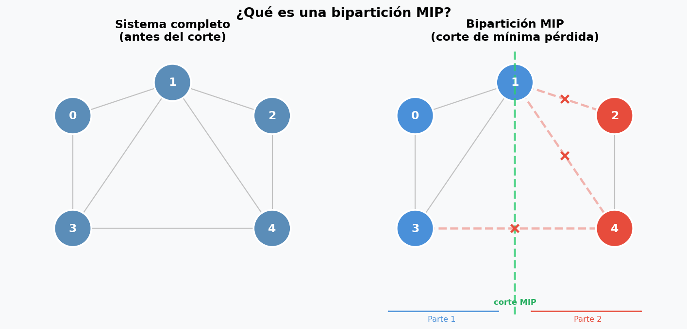
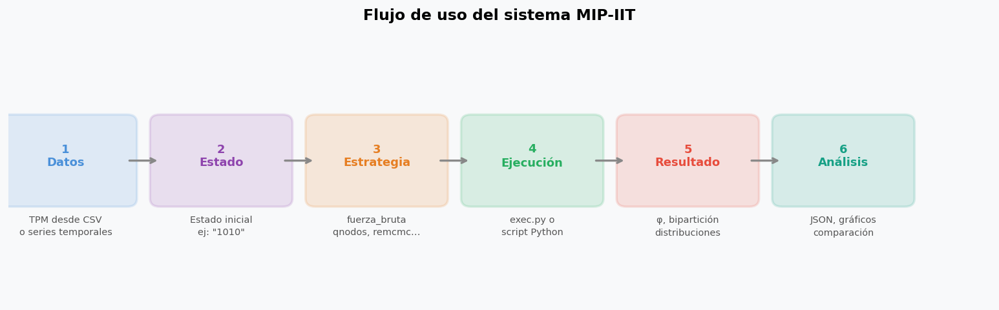
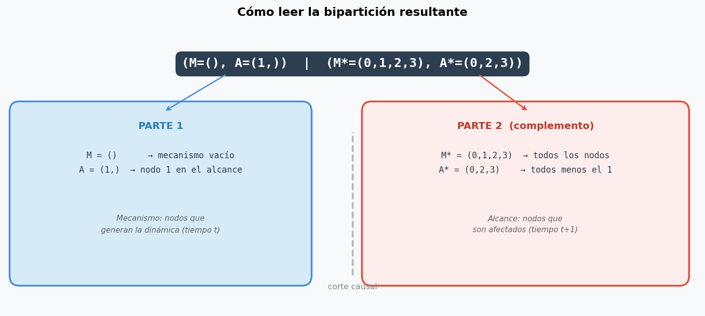
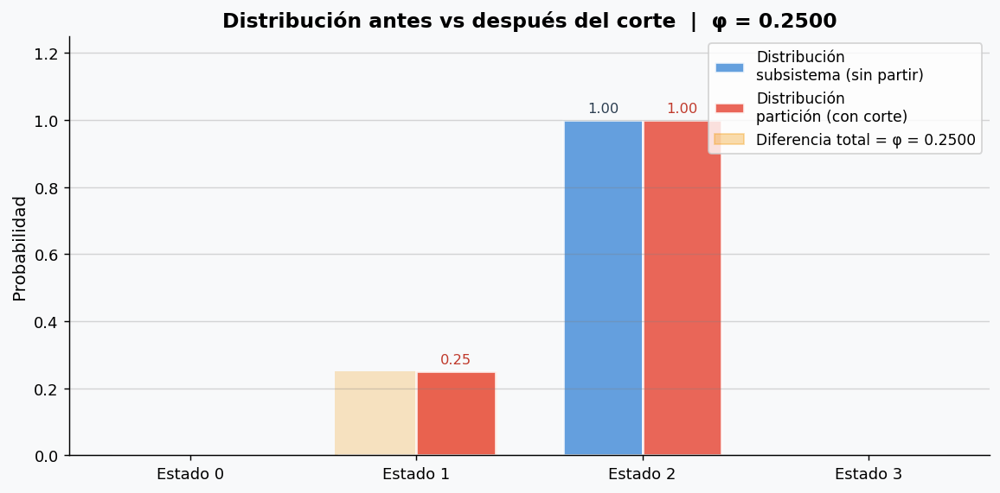
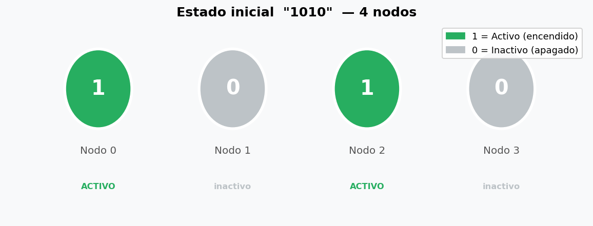
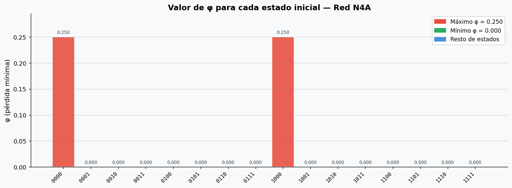
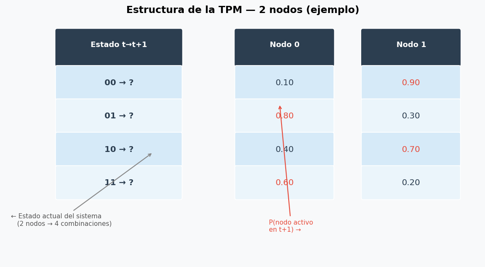
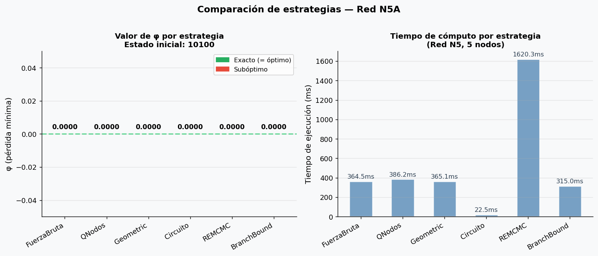

# Manual de Usuario — Sistema MIP-IIT

**Proyecto:** BiparticionOptima  
**Repositorio:** https://github.com/CamiOso/BiparticionOptima  
**Versión Python requerida:** 3.11 o superior

---

## ¿Qué hace este sistema?

Este sistema encuentra la **Partición de Mínima Pérdida de Información (MIP)** de una red neuronal o sistema dinámico estocástico. Dado un sistema de `n` nodos que evoluciona en el tiempo, el programa responde la pregunta:

> ¿Cómo cortar este sistema en dos (o más) partes de tal forma que se pierda la menor cantidad posible de información?

Ese "corte óptimo" es lo que en la Teoría de la Información Integrada (IIT) se llama MIP, y la cantidad de información perdida al hacerlo es el valor **φ (phi)**. Si φ es muy pequeño, el sistema es casi separable. Si φ es grande, los nodos están fuertemente integrados.



El sistema incluye **14 algoritmos** distintos para encontrar esa partición, desde búsqueda exhaustiva hasta métodos inspirados en física cuántica y relatividad.

---

## Flujo general de uso

Antes de entrar en detalles, esta imagen muestra los seis pasos que seguís cada vez que usás el sistema:



---

## Tabla de contenidos

1. [Requisitos](#1-requisitos)
2. [Clonar e instalar](#2-clonar-e-instalar)
3. [Verificar que todo funciona](#3-verificar-que-todo-funciona)
4. [Primera ejecución](#4-primera-ejecución)
5. [Entender la salida](#5-entender-la-salida)
6. [Qué es el estado inicial](#6-qué-es-el-estado-inicial)
7. [Qué es la TPM y cómo cargar tu propia red](#7-qué-es-la-tpm-y-cómo-cargar-tu-propia-red)
8. [Cómo usar cada estrategia](#8-cómo-usar-cada-estrategia)
9. [Guardar resultados en JSON](#9-guardar-resultados-en-json)
10. [Buscar k particiones en lugar de 2](#10-buscar-k-particiones-en-lugar-de-2)
11. [Analizar e interpretar resultados](#11-analizar-e-interpretar-resultados)
12. [Preguntas frecuentes](#12-preguntas-frecuentes)

---

## 1. Requisitos

Antes de empezar necesitás tener instalado:

- **Python 3.11 o superior** — verificá con: `python3 --version`
- **Git** — verificá con: `git --version`
- **pip** (generalmente viene con Python) — verificá con: `pip --version`

No se necesita ningún conocimiento previo de IIT para correr el sistema; alcanza con saber usar la terminal.

---

## 2. Clonar e instalar

### Paso 1 — Clonar el repositorio

```bash
git clone https://github.com/CamiOso/BiparticionOptima.git
cd BiparticionOptima
```

### Paso 2 — Crear un entorno virtual (recomendado)

Un entorno virtual evita conflictos con otras instalaciones de Python en tu máquina:

```bash
python3 -m venv .venv
```

Activarlo:

```bash
# Linux / macOS:
source .venv/bin/activate

# Windows (PowerShell):
.venv\Scripts\Activate.ps1

# Windows (CMD):
.venv\Scripts\activate.bat
```

Cuando está activo, el prompt muestra `(.venv)` al inicio.

### Paso 3 — Instalar dependencias

```bash
pip install -r requirements.txt
```

| Paquete | Para qué sirve |
|---------|----------------|
| `numpy` | Cálculos matriciales de la TPM |
| `pandas` | Lectura de datos en formato tabla |
| `openpyxl` | Compatibilidad con archivos Excel |
| `pytest` | Ejecutar las pruebas automáticas |

---

## 3. Verificar que todo funciona

```bash
pytest tests/ -q
```

Deberías ver algo así al final:

```
..............................
30 passed in 2.14s
```

Si alguna prueba falla, revisá que el entorno virtual esté activado y que las dependencias estén instaladas.

---

## 4. Primera ejecución

Con todo instalado, probá el comando más simple posible:

```bash
python exec.py
```

Esto corre las cuatro estrategias principales (FuerzaBruta, Phi, QNodos y Geometric) sobre la red de muestra incluida con el estado inicial `1000`. En la siguiente sección se explica cómo leer la salida.

---

## 5. Entender la salida

Cuando corrés una estrategia, la salida tiene este formato:

```
Estrategia: FuerzaBruta
Estado inicial: 1000
Perdida: 0.2500
Biparticion: (M=(), A=(1,)) | (M*=(0, 1, 2, 3), A*=(0, 2, 3))
Dist. subsistema: [0.0000, 0.0000, 1.0000, 0.0000]
Dist. particion:  [0.0000, 0.2500, 1.0000, 0.0000]
```

### `Perdida` — el valor φ

Este es el número más importante. Es la mínima pérdida de información al cortar el sistema:

- `0.0000` → el sistema es perfectamente separable, no hay integración
- Cuanto mayor es el valor, más integrado está el sistema

### `Biparticion` — cómo se cortó el sistema

La notación `(M=..., A=...) | (M*=..., A*=...)` describe el corte causal. La siguiente imagen lo explica en detalle:



- **M** = nodos del mecanismo (tiempo t) que van a la Parte 1
- **A** = nodos del alcance (tiempo t+1) que van a la Parte 1
- **M\*** y **A\*** = los nodos que quedan en la Parte 2 (el complemento)

### `Dist. subsistema` vs `Dist. particion`

Estos dos vectores muestran cómo cambia la distribución de probabilidad al aplicar el corte. La diferencia entre ellos es exactamente φ:



- Las barras **azules** son la distribución original del sistema sin partir
- Las barras **rojas** son la distribución después de aplicar el corte
- La zona **naranja** marca la diferencia — cuanto más grande, mayor es φ

Si ambas distribuciones son idénticas, φ = 0 y el sistema es perfectamente separable.

---

## 6. Qué es el estado inicial

El **estado inicial** es una cadena de ceros y unos donde cada posición representa un nodo:



La longitud del estado inicial **debe coincidir** con el número de nodos de la red. Las redes de muestra incluidas son:

| Archivo | Nodos | Estados válidos |
|---------|-------|-----------------|
| `N4A.csv` | 4 | `0000` hasta `1111` |
| `N5A.csv` | 5 | `00000` hasta `11111` |
| `N6A.csv` | 6 | `000000` hasta `111111` |
| `N7A.csv` | 7 | `0000000` hasta `1111111` |
| `N8A.csv` | 8 | `00000000` hasta `11111111` |

El sistema elige automáticamente el archivo según la longitud del estado que le pasés.

El valor de φ **varía según el estado inicial**. Esta gráfica muestra cómo cambia φ en cada uno de los 16 estados posibles de la red N4A:



---

## 7. Qué es la TPM y cómo cargar tu propia red

La **Matriz de Transición de Probabilidades (TPM)** describe cómo evoluciona el sistema: cada fila es un estado posible, y cada columna es la probabilidad de que ese nodo esté activo en el próximo instante:



Para un sistema de `n` nodos, la TPM tiene `2ⁿ` filas y `n` columnas.

### Opción A — Tu propio CSV con TPM

Creá un CSV sin encabezado, una fila por cada estado posible:

```csv
0.1,0.9
0.8,0.3
0.4,0.7
0.6,0.2
```

Cargalo en tu script:

```python
import numpy as np
tpm = np.genfromtxt("mi_red.csv", delimiter=",")
# tpm.shape → (4, 2) para 2 nodos
```

### Opción B — Estimar la TPM desde series temporales

Si tenés mediciones de actividad en el tiempo (filas = instantes, columnas = nodos, valores 0 o 1):

```csv
1,0,1,0
0,1,1,0
1,1,0,1
0,0,1,1
```

Pasalo con `--csv-muestras`:

```bash
python exec.py --estrategia qnodos --estado-inicial 1010 --csv-muestras mis_datos.csv
```

El sistema estima la TPM contando transiciones. Los estados nunca observados reciben probabilidad `0.5` (máxima incertidumbre).

---

## 8. Cómo usar cada estrategia

### Estrategias clásicas (desde el CLI)

```bash
# Fuerza Bruta — siempre exacto, más lento para n grande
python exec.py --estrategia fuerza_bruta --estado-inicial 1010

# QNodos — muy rápido, casi siempre exacto (recomendado)
python exec.py --estrategia qnodos --estado-inicial 1010

# Geometric en modo refinado (default)
python exec.py --estrategia geometric --estado-inicial 1010

# Geometric en modo estricto
python exec.py --estrategia geometric --modo-geometric estricto --estado-inicial 1010

# Phi
python exec.py --estrategia phi --estado-inicial 1010

# Todas las clásicas de un golpe
python exec.py --estado-inicial 1010
```

### Estrategias avanzadas (script Python)

Creá un archivo `mi_analisis.py`:

```python
from src.aplicacion.configuracion import AppConfig
from src.contenedor import Contenedor
from src.aplicacion.casos_de_uso.buscar_particion import EntradaBusqueda
from src.controladores.gestor import Gestor

estado = "1010"
tpm = Gestor(estado_inicial=estado).cargar_red()

n = len(estado)
entrada = EntradaBusqueda(
    estado_inicial=estado,
    condicion="1" * n,
    alcance="1" * n,
    mecanismo="1" * n,
    k=2,
)

caso = Contenedor(AppConfig()).caso_uso_buscar_particion("qnodos", tpm)
resultado = caso.ejecutar(entrada)
print(resultado)
```

```bash
python mi_analisis.py
```

Cambiando `"qnodos"` podés usar cualquiera de estas:

| Nombre | Descripción | Garantía |
|--------|-------------|----------|
| `"fuerza_bruta"` | Exhaustiva | Siempre exacta |
| `"qnodos"` | Greedy submodular | ~100% en sistemas aleatorios |
| `"geometric"` | Recorrido del hipercubo | No garantizada |
| `"circuito"` | Corte espectral del Laplaciano | No garantizada |
| `"louvain"` | Comunidades en grafo | No garantizada |
| `"genetico"` | Algoritmo evolutivo | No garantizada |
| `"bp"` | Belief Propagation | No garantizada |
| `"remcmc"` | Cadenas de Markov paralelas | No garantizada |
| `"ib"` | Information Bottleneck | No garantizada |
| `"bb"` | Branch & Bound | Exacta para n≤7 por lado |
| `"variacional"` | Laplaciano normalizado | No garantizada |
| `"airy"` | Operador de Schrödinger | No garantizada |
| `"hiperbolica"` | Geodésicas (Poincaré/AdS) | No garantizada |

Esta gráfica compara φ y tiempo de ejecución de las principales estrategias sobre la misma red:



---

## 9. Guardar resultados en JSON

```bash
python exec.py --estrategia qnodos --estado-inicial 1010 --output-json resultados/resultado.json
```

El archivo generado tiene esta estructura:

```json
{
  "estrategia_solicitada": "qnodos",
  "estado_inicial": "1010",
  "archivo_tpm": "src/.samples/N4A.csv",
  "resultados": {
    "qnodos": {
      "estrategia": "QNodos",
      "perdida": 0.25,
      "particion": "(M=(), A=(1,)) | (M*=(0,1,2,3), A*=(0,2,3))",
      "distribucion_subsistema": [0.0, 0.0, 1.0, 0.0],
      "distribucion_particion": [0.0, 0.25, 1.0, 0.0],
      "elapsed_seconds": 0.0023
    }
  }
}
```

Para leer y procesar el JSON después:

```python
import json

with open("resultados/resultado.json") as f:
    datos = json.load(f)

r = datos["resultados"]["qnodos"]
print(f"φ = {r['perdida']}")
print(f"Partición: {r['particion']}")
print(f"Tiempo: {r['elapsed_seconds']:.4f}s")
```

Para comparar varios archivos de resultados:

```python
import json, glob

for archivo in glob.glob("resultados/*.json"):
    with open(archivo) as f:
        datos = json.load(f)
    for nombre, res in datos["resultados"].items():
        print(f"{nombre:20s}  φ={res['perdida']:.4f}  t={res['elapsed_seconds']:.4f}s")
```

---

## 10. Buscar k particiones en lugar de 2

Por defecto se busca una bipartición (2 partes). Con `--k-particiones` pedís más grupos:

```bash
# 3 grupos con Geometric
python exec.py --estrategia geometric --k-particiones 3 --estado-inicial 1000

# 4 grupos
python exec.py --estrategia geometric --k-particiones 4 --estado-inicial 10000
```

Con k > 2 la salida describe la asignación de cada nodo:

```
Particion: G0: nodos [0,2] | G1: nodos [1,3] | G2: nodos [4]
```

| Estrategia | Soporta k > 2 |
|------------|---------------|
| `geometric` | Sí |
| `qnodos` | Sí |
| `remcmc` | Sí |
| `hiperbolica` | Sí |
| `genetico` | Sí |
| `fuerza_bruta` | No |
| `bb` | No |

---

## 11. Analizar e interpretar resultados

### ¿Qué estrategia elegir?

| Situación | Estrategia recomendada |
|-----------|------------------------|
| Quiero el resultado exacto, n ≤ 7 nodos/lado | `fuerza_bruta` o `bb` |
| Quiero rapidez y casi siempre exacto | `qnodos` |
| Sistema grande (n > 8) | `remcmc` o `genetico` |
| Comparar varios algoritmos | correr `todas` (default) |
| Sistema con estructura de comunidades | `louvain` o `circuito` |

### Comparar varias estrategias sobre el mismo sistema

```python
from src.aplicacion.configuracion import AppConfig
from src.contenedor import Contenedor
from src.aplicacion.casos_de_uso.buscar_particion import EntradaBusqueda
from src.controladores.gestor import Gestor

estado = "1010"
tpm = Gestor(estado_inicial=estado).cargar_red()
n = len(estado)
entrada = EntradaBusqueda(estado, "1"*n, "1"*n, "1"*n, k=2)
config = AppConfig()

for nombre in ["fuerza_bruta", "qnodos", "circuito", "remcmc"]:
    caso = Contenedor(config).caso_uso_buscar_particion(nombre, tpm)
    res = caso.ejecutar(entrada)
    print(f"{nombre:15s}  φ={res.perdida:.6f}  {res.particion}")
```

Si todas dan el mismo φ, el resultado es confiable. Si alguna difiere, probablemente encontró un mínimo local — intentá con `bb` o `fuerza_bruta` para confirmar el óptimo real.

### Explorar cómo varía φ según el estado inicial

```python
from src.aplicacion.configuracion import AppConfig
from src.contenedor import Contenedor
from src.aplicacion.casos_de_uso.buscar_particion import EntradaBusqueda
from src.controladores.gestor import Gestor

tpm = Gestor(estado_inicial="0000").cargar_red()
config = AppConfig()

print(f"{'Estado':8s}  {'φ':>8s}  Partición")
print("-" * 65)
for i in range(16):
    estado = format(i, "04b")
    n = len(estado)
    caso = Contenedor(config).caso_uso_buscar_particion("qnodos", tpm)
    entrada = EntradaBusqueda(estado, "1"*n, "1"*n, "1"*n)
    res = caso.ejecutar(entrada)
    print(f"{estado:8s}  {res.perdida:>8.4f}  {res.particion}")
```

Esto genera una tabla como la representada en la [gráfica de φ por estado](#6-qué-es-el-estado-inicial).

### Interpretar cuándo φ = 0

Si el sistema devuelve `Perdida: 0.0000`, significa que existe un corte que **no produce ninguna pérdida de información** — el sistema es separable en esa dirección. Esto puede pasar cuando:

- El estado inicial hace que un nodo sea determinista e independiente de los demás
- La TPM tiene alguna estructura de independencia condicional

### Qué significa que dos estrategias den distinta partición pero mismo φ

Puede haber múltiples biparticiones con el mismo valor mínimo de φ — son empates. Cualquiera de ellas es igualmente válida como respuesta al problema MIP.

---

## 12. Preguntas frecuentes

**¿Por qué falla con `ModuleNotFoundError: No module named 'scipy'`?**  
La estrategia `ilp` requiere scipy. Instalalo con `pip install scipy`. El resto de estrategias no lo necesita.

**¿Por qué el CLI solo acepta algunas estrategias?**  
`exec.py` expone las estrategias clásicas. Para las avanzadas usá el script Python de la sección 8.

**¿El estado inicial afecta los resultados?**  
Sí. La MIP se calcula condicionada al estado inicial. Estados distintos pueden dar φ y particiones distintas para la misma red.

**¿Cuántos nodos puede manejar el sistema?**  
Las redes de muestra van de 4 a 8 nodos. Con TPM propia podés usar más, pero `fuerza_bruta` crece exponencialmente. Para n > 8 usá `qnodos`, `remcmc` o `genetico`.

**¿Cómo sé si encontré el óptimo global?**  
Solo `fuerza_bruta` y `bb` (para n≤7 por lado) garantizan el óptimo. El resto son heurísticas — compará siempre con `fuerza_bruta` en sistemas pequeños para validar.

**¿Puedo usarlo en Google Colab o Jupyter?**  
Sí. Cloná el repo, instalá las dependencias con `!pip install -r requirements.txt` y usá el script Python de la sección 8 en una celda.
